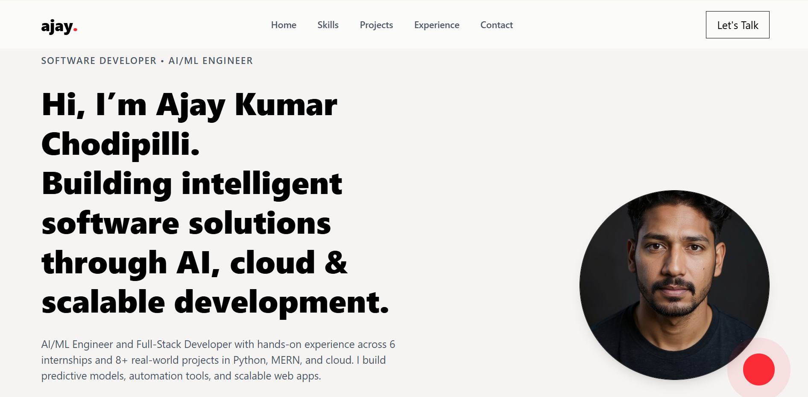
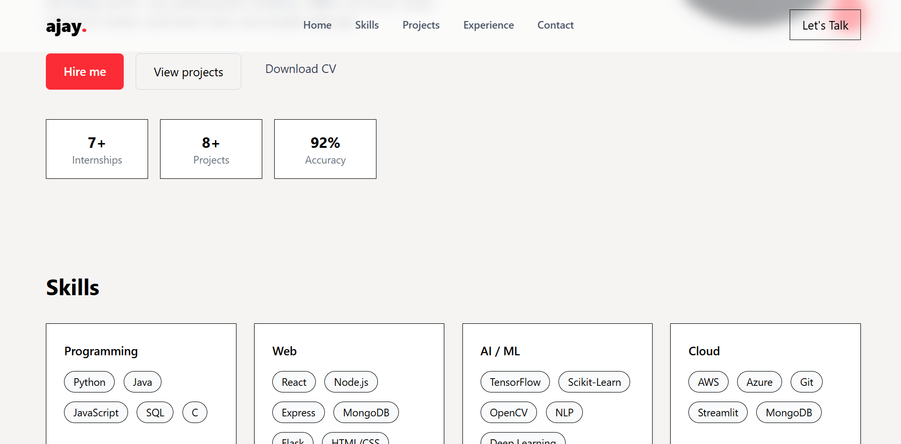
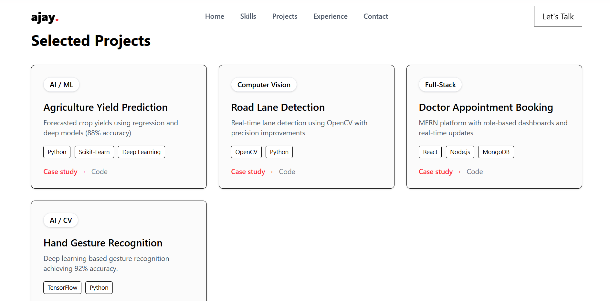
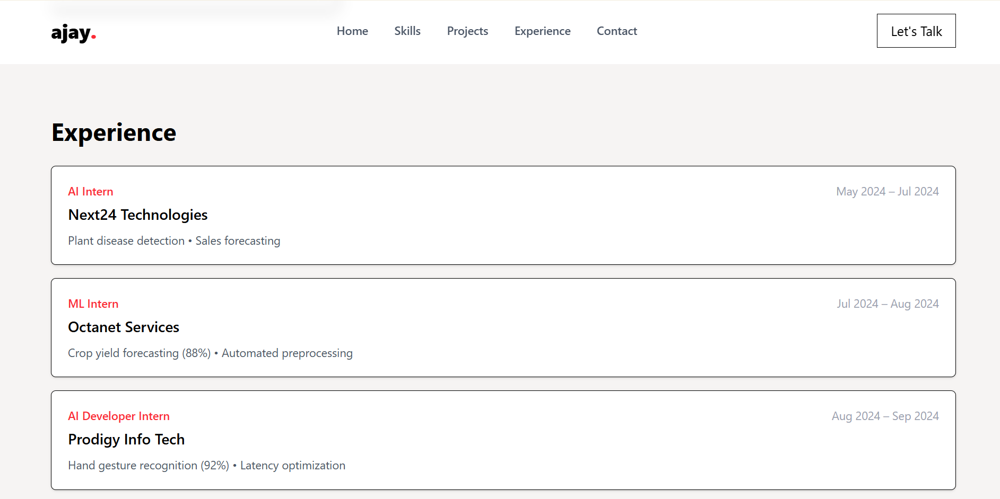

# 🚀 Developer Portfolio — Ajay Kumar Chodipilli

A modern, fully responsive **Software Developer + AI/ML Engineer Portfolio** built using  
**React (Vite) + Tailwind CSS v4**.

Designed to present **projects, skills, experience, achievements, and certifications** in a clean and visually premium layout — optimized for recruiters and companies.

---

## 🔗 Live Demo  
🚧 https://dev-portfolio-sandy-iota.vercel.app/
---
📁 Repository: https://github.com/Ajaykumarch15/DEV_PORTFOLIO

---

## 👨‍💻 Author

**Ajay Kumar Chodipilli**  
Software Developer | AI/ML Engineer | Full-Stack Developer  

📧 Email: **ajaykumarchodipilli15@gmail.com**  
🔗 LinkedIn: https://www.linkedin.com/in/ajay-kumar-ch-3ba8b7259/  
💻 GitHub: https://github.com/Ajaykumarch15  

---

## ✨ Features

- ⚡ **Fast** React + Vite setup  
- 🎨 Tailwind CSS v4 styling (latest 2025 version)  
- 📱 Fully responsive UI (mobile-first)  
- 🧩 Modular component architecture  
- 🎭 Professionally designed hero section  
- 🧠 AI/ML, Full-Stack & Cloud skill sections  
- 📚 Dynamic project cards  
- 📝 Experience timeline  
- 🛡️ Certifications section  
- 📬 Contact section with form  
- 🚀 Ready for deployment on Vercel/Netlify/GitHub Pages  

---

## 🖼️ Preview (Add screenshots later)

> Replace these placeholders once your site is deployed:

| Home Section | Projects Section |
|--------------|------------------|
|  |  |
|  |  |


---

## 🛠️ Tech Stack

### **Frontend**
- ⚛️ React (Vite)
- 🎨 Tailwind CSS v4
- 🧩 JSX Components

### **Tools**
- 🛠️ Git & GitHub  
- 🧱 Node.js  
- ⚡ Vite Bundler  

---


## ⚙️ Installation

Follow the steps to run this project locally:

### 1️⃣ Clone the repository
```bash
git clone https://github.com/Ajaykumarch15/DEV_PORTFOLIO.git
cd DEV_PORTFOLIO
2️⃣ Install dependencies
npm install

3️⃣ Start development server
npm run dev


Runs at:

http://localhost:5173/

🎨 Tailwind CSS v4 Setup
src/index.css
@import "tailwindcss";

vite.config.js
import { defineConfig } from 'vite'
import react from '@vitejs/plugin-react'
import tailwindcss from '@tailwindcss/vite'

export default defineConfig({
  plugins: [
    react(),
    tailwindcss(),
  ],
})

🚀 Deployment
Deploy to Vercel
npm run build
vercel

Deploy to Netlify
npm run build
# Drag & drop dist/ folder to Netlify dashboard

Deploy to GitHub Pages

Use vite plugin:

npm run build

🎯 Future Enhancements

🌓 Dark Mode

✨ Framer Motion animations

🧾 Blog section

📄 Dynamic project details pages

🔥 Backend integration for contact form

🤝 Contributing

Contributions are welcome!
Feel free to fork the repo and submit a pull request.

📄 License

This project is licensed under the MIT License.
